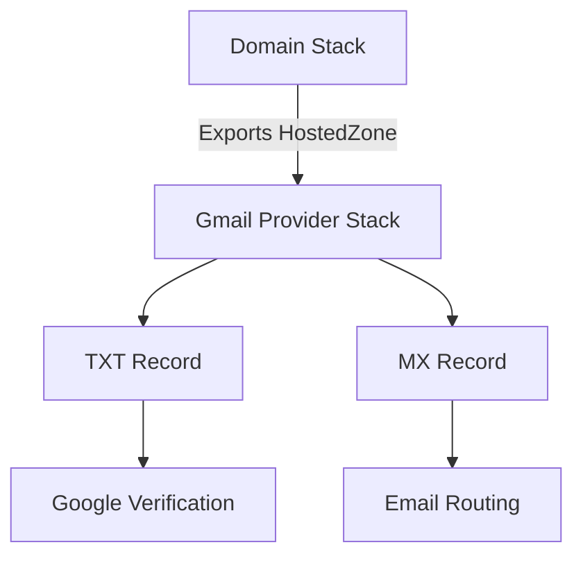

# Gmail Email Provider AWS CDK Stack

This AWS CDK stack configures Gmail as an email provider for your custom domain
through DNS verification. It automatically sets up the necessary Route53 DNS
records to enable Gmail services for your domain.

## Purpose and Features

- **DNS Verification**: Creates Google site verification TXT record
- **Email Routing**: Configures MX record to route emails through Gmail
- **Cross-Stack Integration**: Imports existing hosted zone from another stack
- **Configurable TTL**: Allows customization of DNS record time-to-live
- **Output Values**: Provides verification details for troubleshooting

## Resources Created

### Route53 TXT Record

Creates a TXT record for Google site verification:

```text
domain.com. IN TXT "google-site-verification=your-verification-code"
```

### Route53 MX Record

Creates an MX record pointing to Gmail servers:

```text
domain.com. IN MX 1 smtp.google.com.
```

### CloudFormation Imports

The stack imports the hosted zone using CloudFormation cross-stack references:

- `{domain-name}-HostedZoneId`: Imported hosted zone ID
- `{domain-name}-HostedZoneName`: Imported hosted zone name

## Prerequisites

### Required Infrastructure

1. **Existing Domain Stack**: A deployed stack that exports hosted zone details
2. **AWS Route53 Hosted Zone**: Active hosted zone for your domain
3. **Google Workspace Account**: Gmail/Google Workspace setup for your domain

### Required Tools

- AWS CDK v2.x
- Python 3.8+
- AWS CLI configured with appropriate permissions

### AWS Permissions

Your deployment role needs these permissions:

- `route53:ChangeResourceRecordSets`
- `route53:GetHostedZone`
- `route53:ListResourceRecordSets`
- `cloudformation:ListExports`

## Usage Instructions

### 1. Install Dependencies

```bash
pip install aws-cdk-lib constructs
```

### 2. Create Configuration

Create a configuration dictionary with your domain details:

```python
config = {
    "domain_name": "example.com",
    "google_site_verification": "your-google-verification-code",
    "ttl": 300  # Optional, defaults to 300 seconds
}
```

### 3. Deploy the Stack

```python
#!/usr/bin/env python3
from aws_cdk import App
from stack import GmailEmailProviderStack

app = App()
GmailEmailProviderStack(
    app, 
    "GmailEmailProviderStack",
    config={
        "domain_name": "example.com",
        "google_site_verification": "abc123def456"
    }
)
app.synth()
```

### 4. CDK Deployment Commands

```bash
# Bootstrap CDK (first time only)
cdk bootstrap

# Deploy the stack
cdk deploy

# View stack outputs
aws cloudformation describe-stacks \
  --stack-name GmailEmailProviderStack \
  --query 'Stacks[0].Outputs'
```

## Architecture

### DNS Verification Flow

1. **Google Verification**: TXT record proves domain ownership to Google
2. **Email Routing**: MX record directs emails to Gmail servers
3. **DNS Resolution**: Route53 serves records to email clients worldwide

### Stack Dependencies



### Cross-Stack References

The stack uses CloudFormation's `Fn::ImportValue` to reference:

```python
hosted_zone_id = Fn.import_value(f"{export_prefix}-HostedZoneId")
hosted_zone_name = Fn.import_value(f"{export_prefix}-HostedZoneName")
```

## Configuration Details

### Required Parameters

| Parameter | Type | Description | Example |
|-----------|------|-------------|---------|
| `domain_name` | string | Your domain name | `example.com` |
| `google_site_verification` | string | Verification code | `abc123def456` |

### Optional Parameters

| Parameter | Type | Default | Description |
|-----------|------|---------|-------------|
| `ttl` | integer | 300 | DNS record TTL in seconds |

### Getting Google Site Verification Code

1. Go to Google Workspace Admin Console
2. Navigate to Domains section
3. Add your domain
4. Choose "TXT record" verification method
5. Copy the verification code (without the `google-site-verification=` prefix)

## Testing

### Verify DNS Records

Check TXT record propagation:

```bash
dig TXT example.com +short
```

Check MX record configuration:

```bash
dig MX example.com +short
```

### Test Email Delivery

```bash
# Send test email
echo "Test email body" | mail -s "Test Subject" user@example.com

# Check MX record priority
nslookup -type=MX example.com
```

### CloudFormation Validation

```bash
# Verify stack outputs
aws cloudformation describe-stacks \
  --stack-name GmailEmailProviderStack \
  --query 'Stacks[0].Outputs[*].[OutputKey,OutputValue]' \
  --output table
```

## Security Considerations

### DNS Security

- **TTL Values**: Lower TTL allows faster updates but increases DNS queries
- **Record Validation**: Verify TXT record contains only your verification code
- **Access Control**: Limit Route53 permissions to necessary principals

### Domain Verification

- **Verification Code**: Keep Google verification code confidential
- **Domain Ownership**: Ensure you own the domain before adding records
- **Certificate Transparency**: DNS records are publicly visible

### Monitoring

Consider setting up CloudWatch alarms for:

- Route53 query patterns
- Failed DNS resolutions
- Unusual traffic patterns

## Troubleshooting

### Common Issues

#### Stack Deployment Fails

```bash
# Check if prerequisite stack exports exist
aws cloudformation list-exports \
  --query 'Exports[?Name==`example-com-HostedZoneId`]'
```

#### DNS Records Not Propagating

```bash
# Check record creation in Route53
aws route53 list-resource-record-sets \
  --hosted-zone-id Z1D633PJN98FT9 \
  --query 'ResourceRecordSets[?Type==`TXT`]'
```

#### Google Verification Failing

1. Verify TXT record value matches Google's requirements
2. Wait for DNS propagation (up to 48 hours)
3. Check for conflicting TXT records

#### Email Not Routing to Gmail

1. Confirm MX record points to `smtp.google.com`
2. Verify MX record priority is set to 1
3. Check Google Workspace domain configuration

### Debug Commands

```bash
# Check DNS propagation globally
dig @8.8.8.8 TXT example.com
dig @1.1.1.1 MX example.com

# Validate CloudFormation exports
aws cloudformation describe-stacks \
  --query 'Stacks[*].Outputs[?ExportName!=null]'

# Monitor Route53 query logs (if enabled)
aws logs filter-log-events \
  --log-group-name /aws/route53/example.com
```

### Support Resources

- AWS Route53 Documentation: <https://docs.aws.amazon.com/route53/>
- Google Workspace Admin Help: <https://support.google.com/a/>
- AWS CDK API Reference: <https://docs.aws.amazon.com/cdk/>
